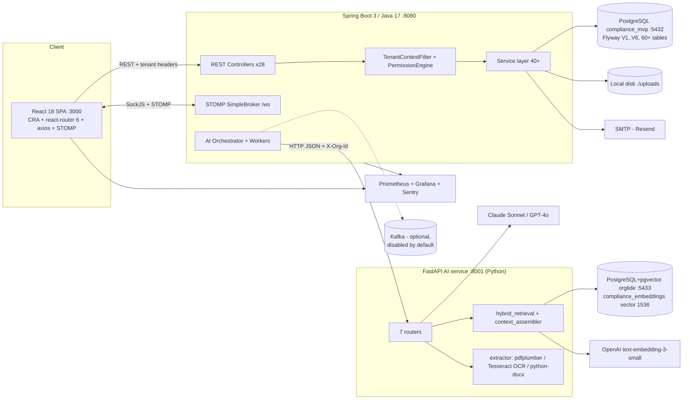
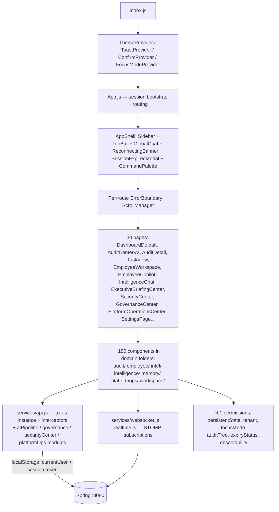
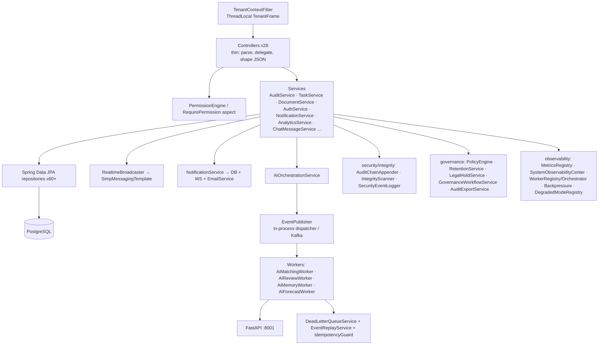
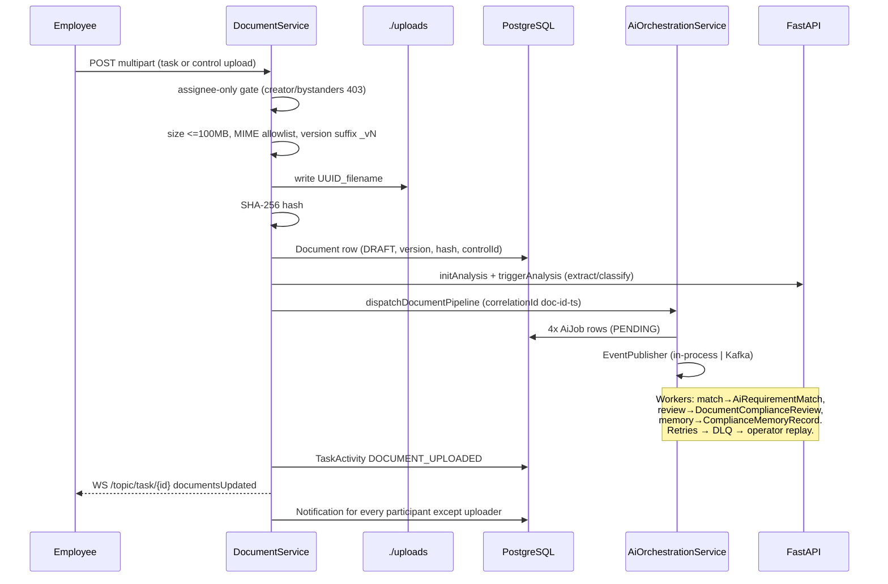
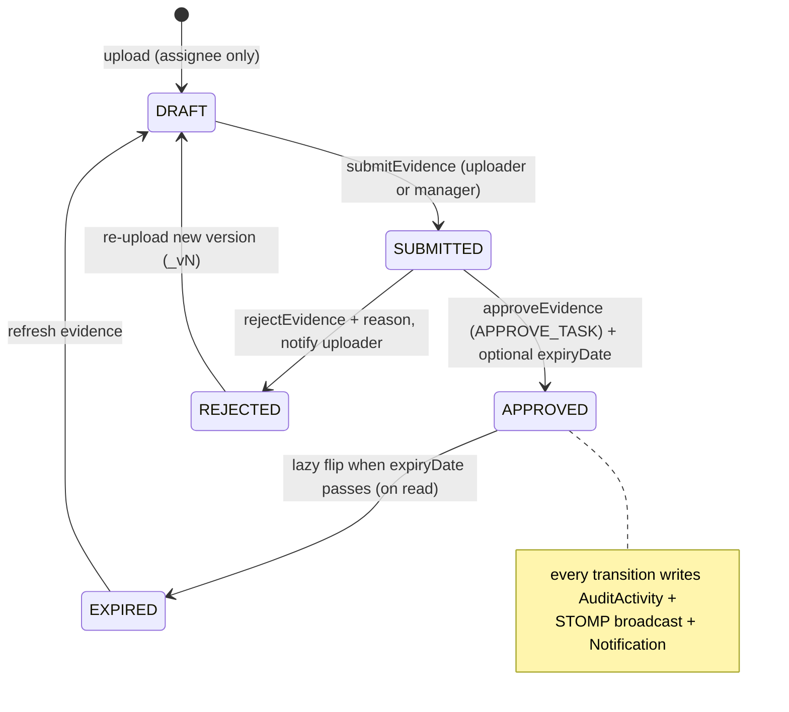
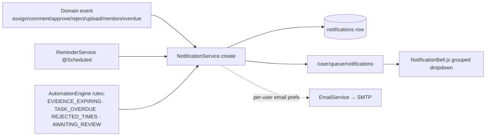
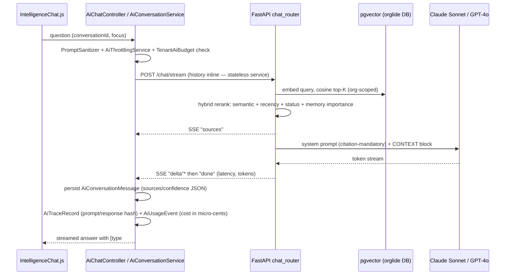
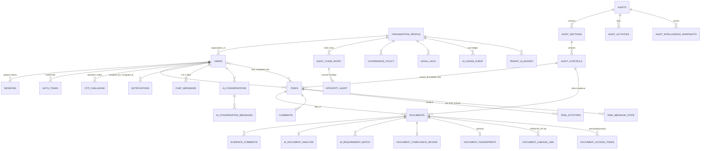

# ORGLIDE — Engineering Deep Dive

> Internal engineering design review, prepared as if by a Principal Engineer joining the team.
> Every claim in this document is grounded in the actual code under `D:\Downloads\Workflou`
> (`compliance-mvp/backend`, `compliance-mvp/frontend`, `ai-service/`). Where something exists
> only as configuration, scaffolding, or intent, it is explicitly marked
> **"Partially implemented"** or **"Designed but not implemented."**
>
> Codebase measured at review time: **~41,900 lines of Java across 211 files** (28 controllers,
> 40+ services, 66 JPA entities, 60+ repositories), **~45,000 lines of frontend JS** (30 pages,
> ~180 components), a **FastAPI Python AI microservice** (7 routers, 13 service modules),
> a **1,604-line Flyway V1 baseline schema** (60+ tables), and **zero backend test files**
> (5 Cypress E2E specs on the frontend).

---

## 1. Product Story

### The problem
Compliance and audit preparation in most mid-size companies lives in email threads,
spreadsheets, and shared drives. A manager preparing for an ISO 27001 or SOC 2 audit asks
twenty employees for evidence documents by email, tracks status in Excel, chases re-submissions
by Slack, and assembles the final binder by hand. There is no defensible trail of who uploaded
what, when it was approved, or whether the approved certificate has since expired.

ORGLIDE replaces that with a single system of record **and** system of action for audit
execution: model the audit as a hierarchy (Audit → Sections → Controls/Requirements), assign
evidence collection as tasks, run a formal submit → review → approve/reject/refine workflow,
and let an AI layer read every uploaded document, classify it, match it to requirements, score
its readiness, and surface risk before the human reviewer even opens it.

### Who the users are
The `Role` enum is the honest map of the personas (`model/Role.java`):

| Role | What they do in the product |
|---|---|
| **EMPLOYEE** | Receives tasks/requirements, uploads evidence, uses the Employee Copilot (requirement explainers, submission-readiness checks, rejection-recovery guidance, smart nudges) |
| **TEAM_LEAD** | Approves/rejects evidence and tasks for their group |
| **MANAGER** | Creates audits/sections/controls, assigns owners + due dates + priorities, reviews evidence, runs automation rules, sees analytics and AI governance |
| **EXECUTIVE** | Read-only intelligence surfaces: org health, risk clusters, executive briefings, strategic memory — explicitly denied access to employee copilot surfaces (a deliberate "non-surveillance" rule in `PermissionEngine.DENIES`) |
| **ADMIN** | Tenant admin: invites/suspends users, governance policies, legal holds, retention, exports |
| **SYSTEM_ADMIN** | Platform operator: cross-tenant, platform operations center |

### Why a company would buy this
1. **Defensibility.** Every mutation lands in an activity stream, and security-relevant events
   are appended to a per-tenant **SHA-256 hash chain** (`AuditChainEntry` + `IntegrityScanner`
   re-verifying every 5 minutes). "Prove nobody tampered with the audit trail" is a real,
   uncommon feature.
2. **Cycle-time.** The AI pipeline (extract → classify → match-to-requirement → readiness
   review) means evidence arrives pre-triaged; the employee copilot reduces
   rejected-first-submissions.
3. **Continuous compliance.** Evidence carries an expiry date; approved documents lazily flip
   to EXPIRED and feed reminders, automation rules, and the calendar — compliance doesn't end
   when the audit does.

### What makes it different from document management software
A DMS stores files. ORGLIDE stores *obligations*: the unit of work is a **requirement**
(`AuditControl`) with an owner, a due date, a priority, and an approval state machine — the
document is just evidence attached to it. The AI is grounded in the org's own compliance graph
via pgvector retrieval (audits, controls, evidence are indexed and citable as
`[control#VC-12]`), not a generic chatbot. And the platform records *why* AI said what it said
(`AiTraceRecord` with prompt/response hashes, `AiOverrideRecord` when a human overrides it) —
an AI-governance posture a DMS has no concept of.

### Business value, in one sentence
ORGLIDE converts audit preparation from an unmeasurable email exercise into a measurable
workflow with per-requirement status, tamper-evident history, expiring-evidence hygiene, and
AI-assisted review — cutting reviewer effort and making the company permanently "audit-ready."

---

## 2. Technical Story — from first login to a completed audit

The system is three deployables plus two data stores:

- **React 18 SPA** (CRA, `frontend/`) on :3000
- **Spring Boot 3 / Java 17 backend** (`backend/`) on :8080 — REST + STOMP WebSocket
- **FastAPI AI service** (`ai-service/`) on :8001 — extraction, LLM calls, embeddings, retrieval
- **PostgreSQL `compliance_mvp`** (:5432) — all relational state, Flyway-managed
- **PostgreSQL + pgvector `orglide`** (:5433, Docker `pgvector/pgvector:pg16`) — the
  `compliance_embeddings` semantic index used only by the Python service

### Login
1. `Login.js` posts `{email, password}` to `POST /api/auth/login` (`AuthController`).
2. `AuthService.login` (no Spring Security — a hand-rolled but careful flow): finds the user,
   rejects suspended accounts with a specific message, rejects never-activated accounts
   (activation requires email OTP first — a deliberate fix for an account-seizure hole,
   documented in the code comment at `AuthService.java:113`), verifies the password with
   **PBKDF2** (`PasswordHasher`), stamps `lastLoginAt`, and issues an opaque **14-day
   server-side session** — a 32-byte random Base64URL token persisted as a `Session` row with
   device label, revocable individually or via "sign out other devices."
3. Every auth event (success, failure, suspended-login, OTP sent/failed) is written to the
   `SecurityEvent` log and counted in Prometheus (`OperationalMetrics.authFailure(reason)`).
4. The SPA stores the token in `localStorage` (`orglide:sessionToken`) and the user object in
   `localStorage.currentUser`. On boot, `App.js` calls `POST /api/auth/validate` to confirm the
   token and refresh the user.

**The critical caveat:** after login, per-request identity is *not* the session token. The
axios interceptor (`services/api.js:46`) sends `X-User-Id`, `X-Org-Id`, `X-Correlation-Id`,
and `X-Session-Token` on every call, but `TenantContextFilter` on the backend resolves the
actor **from the `X-User-Id` header alone** (the session token is attached but not verified
per-request — `AuthController`'s Javadoc admits this: *"validation is explicit … keeping the
existing X-User-Id data path untouched"*). Org ID is looked up from the user row (never trusted
from the client; a mismatched `X-Org-Id` is rejected as a tenant violation), but the user ID
itself is client-asserted. This is the single most important security gap in the system —
covered in §14.

### Request context and authorization
`TenantContextFilter` (`@Order(HIGHEST_PRECEDENCE+10)`) installs a `ThreadLocal` **TenantFrame**
`(organizationId, userId, role, correlationId)` for every request and echoes the correlation ID
back on the response. Services then call `PermissionEngine.assertCan(Permission)` — a static
role→permission `EnumMap` with an explicit `DENIES` overlay (executives can never touch
employee-copilot surfaces). Denials are audited (`PermissionAuditService`) and return a
deliberately generic 403; cross-tenant reads return 404 so existence is never leaked
(`assertSameTenant`). There is also a declarative option: `@RequirePermission` +
`RequirePermissionAspect` (AOP).

### The audit lifecycle
1. **Create.** Any authenticated user may create an `Audit` (folder); managers/admins hold
   `MANAGE_AUDIT` for rename/archive/soft-delete (Audit Center V2 row actions). Sections and
   controls (requirements) are added under it (`AuditService.createSection/createControl`).
2. **Assign.** `assignControl` (gated by `APPROVE_TASK`) sets owner, due date, priority —
   partial updates supported — logs a `CONTROL_ASSIGNED` activity and notifies the new owner.
   Work can also be modeled as `Task`s (multi-assignee, `LinkControlRequest` links a task to a
   control and back-propagates `controlId` onto its existing documents).
3. **Upload.** Employee uploads via task (`DocumentService.upload` — **assignees only**,
   managers explicitly cannot deliver evidence) or directly to a control (`uploadToControl`).
   The file is validated (≤100 MB; MIME allowlist: images, video, PDF, DOC/DOCX), stored on
   local disk under a UUID-prefixed name, SHA-256-hashed, versioned by filename suffix
   (`_v2`, `_v3` via regex), and saved as a `Document` row in `DRAFT` state.
4. **AI pipeline (automatic).** The upload triggers `AiAnalysisService` (extraction +
   classification) directly, then `AiOrchestrationService.dispatchDocumentPipeline` fans out
   three events — `AI_MATCH_REQUESTED`, `AI_REVIEW_REQUESTED`, `AI_MEMORY_SCAN_REQUESTED` —
   each tracked as a durable `AiJob` row and published through `EventPublisher` (in-process
   dispatcher by default; Kafka when `orglide.kafka.enabled=true`). Workers
   (`AiMatchingWorker`, `AiReviewWorker`, `AiMemoryWorker`) consume them, call the FastAPI
   service, and persist `AiRequirementMatch`, `DocumentComplianceReview`,
   `ComplianceMemoryRecord` rows. Failures retry with backoff, escalate via
   `RetryEscalationPolicy`, and dead-letter into `DeadLetterEvent` with an operator replay UI.
   Jobs hold leases; `StuckJobRecoveryScheduler` reclaims work from dead workers.
5. **Submit → Review.** The uploader (or a manager on their behalf) submits
   (`AuditService.submitEvidence`, DRAFT→SUBMITTED). A reviewer holding `APPROVE_TASK`
   approves (optionally setting an expiry date) or rejects with a reason. Every transition
   appends an `AuditActivity` row and broadcasts a flat DTO over STOMP
   (`/topic/audit-activity`, `/topic/audit/{id}`, and tenant-scoped mirrors
   `/topic/org/{orgId}/...`) so every open dashboard updates without polling. The uploader is
   notified (`NotificationService` → DB row + `/user/queue/notifications` push + optional
   email).
6. **Revision loop.** Rejected evidence returns to the employee; task-level review supports a
   dedicated `REFINE_REQUIRED` status. The Employee Copilot's `RejectionRecoveryPanel` and
   `SubmissionQualityService` help the resubmission succeed.
7. **Completion & posture.** There is no explicit "audit completed" state on `Audit` —
   completion is derived: dashboards (`AuditKpiStrip`, `ComplianceOverview`,
   `AuditIntelligenceService` readiness/risk/health scores persisted as
   `AuditIntelligenceSnapshot`) show approved-vs-pending coverage;
   `AuditService.buildReport` exports the full hierarchy + evidence as JSON.
   **Partially implemented:** a formal completion/sign-off workflow is designed around export
   bundles (`AuditExportService`) but there is no terminal audit state machine.
8. **Ongoing hygiene.** Approved evidence with a passed `expiryDate` is lazily flipped to
   EXPIRED on read (`getEvidenceTable`/`getSummary` — a write-on-read pattern, see §14).
   `ReminderService` and `AutomationEngine` (rules like `EVIDENCE_EXPIRING_WITHIN_DAYS` →
   `ESCALATE_TO_MANAGERS`) generate notifications; the Calendar feed merges task due dates,
   evidence expiries, and control review dates, reclassifying anything past-due as `overdue`.

### The conversational AI (Intelligence Chat)
`AiConversationService` (Spring) owns conversation persistence; the Python `chat_engine` is
**stateless** — history is passed inline each call, so the AI service scales horizontally with
no sticky sessions. A question flows: SPA → Spring (SSE proxy) → FastAPI `/chat/stream` →
`context_assembler` pulls top-K chunks from pgvector via `hybrid_retrieval` (weighted rerank:
cosine similarity + recency decay + entity-status boost + memory-importance, with a per-source
explainable `ScoreBreakdown`) → Claude Sonnet or GPT-4o (provider-switchable in `config.py`)
streams deltas back as SSE events (`sources` → `delta`* → `done`). The system prompt hard-bans
uncited claims and mandates `[source_type#source_id]` citations. Every exchange is recorded
with latency, token counts, sources JSON, and cost in micro-cents (`AiUsageEvent`), subject to
tenant budgets (`TenantAiBudget`) and throttling (`AiThrottlingService`).

---

## 3. Architecture (Mermaid)

### 3.1 High-level architecture



### 3.2 Frontend architecture



State management is deliberately **not** Redux: server state is fetched per page via the api
modules, realtime deltas arrive over STOMP, cross-cutting UI state lives in small React
contexts (theme, focus mode) and `localStorage`-backed helpers (`persistentState.js`,
`continuityStore.js`, `scheduleStore.js`).

### 3.3 Backend architecture



### 3.4 Authentication flow

```mermaid
sequenceDiagram
  participant U as User
  participant SPA as React SPA
  participant BE as Spring Boot
  participant DB as PostgreSQL
  participant M as SMTP (Resend)

  Note over U,M: Invite/activation (admin-driven)
  U->>SPA: enters email
  SPA->>BE: POST /api/auth/account-state
  BE-->>SPA: NEW | ACTIVATION_REQUIRED | ACTIVE | SUSPENDED
  SPA->>BE: POST /api/auth/otp/request (ACTIVATE or RESET)
  BE->>DB: OtpChallenge (PBKDF2-hashed code, TTL 10m, max 5 attempts)
  BE->>M: branded OTP email (devCode echoed only in dev)
  U->>SPA: enters 6-digit code
  SPA->>BE: POST /api/auth/otp/verify
  BE->>DB: mint 15-min AuthToken (password-set ticket)
  SPA->>BE: consume token + new password
  BE->>DB: PBKDF2 hash, status=ACTIVE, revoke all sessions, issue Session

  Note over U,M: Normal login
  U->>SPA: email + password
  SPA->>BE: POST /api/auth/login
  BE->>DB: verify PBKDF2, check suspended/activated
  BE-->>SPA: user + opaque 14-day session token
  SPA->>SPA: localStorage: currentUser + orglide:sessionToken
  Note over SPA,BE: Every later request carries X-User-Id, X-Org-Id,<br/>X-Correlation-Id, X-Session-Token headers.<br/>WARNING: identity resolved from X-User-Id; token only<br/>validated explicitly at app boot (/api/auth/validate).
```

### 3.5 Upload flow



### 3.6 Audit (evidence review) flow



### 3.7 Notification flow



### 3.8 AI flow (chat + document pipeline)



### 3.9 Database relationships (core subset of 60+ tables)



Plus, in the **separate** pgvector database: `compliance_embeddings (organization_id,
source_type, source_id, chunk_index, content, metadata JSONB, embedding vector(1536))` with a
uniqueness constraint making re-indexing an UPSERT.

---

## 4. Every Major Module

> Format: **Purpose · Responsibilities · Files · Communication · Key classes/APIs · Data flow · Improvements.**

### 4.1 Dashboard
- **Purpose:** role-adaptive landing surface ("what needs my attention now").
- **Files:** `pages/DashboardDefault.js`, `DashboardActionCenter.js`, `DashboardAnalytics.js`, `components/workspace/*` (KpiCard, TaskHub, AttentionCenter, ContinueWorking, RightRail), `components/intelligence/*` (DailyBriefing, PrioritizedTasks, ManagerActionCenter, WorkloadBalancePanel).
- **Communication:** reads `/tasks?...`, `/analytics/*`, `/notifications`, audit summary endpoints; subscribes to `/topic/user/{id}/tasks` and `/user/queue/task-unread` for live pills.
- **Data flow:** page mounts → parallel axios fetches → local component state → STOMP deltas patch it. KPI history is cached in `localStorage` (`kpiHistory.js`) to draw sparkline trends.
- **Improvements:** the "intelligence" panels compute heuristics client-side per mount; a server-side read model (one endpoint returning the composed dashboard) would cut request fan-out.

### 4.2 Workspace (Employee)
- **Purpose:** the employee's daily execution surface plus an assistant-style home.
- **Files:** `pages/EmployeeWorkspace.js`, `components/employee/*` (TodayAgenda, TodayPriorityCard, GuidedSubmissionFlow, SubmissionReadinessBar, UploadGuidancePanel, RejectionRecoveryPanel, SmartNudgeCard, TaskAiAssistant, TrustBadge), `components/workspace/*` (AssistantHero, ChatComposer, AssistantQuickActions).
- **Backend:** `EmployeeAiController` + `EmployeeAiService`, `SmartNudgeService`, `SubmissionQualityService`, `RequirementExplanationService`, `EmployeeAiMemory`/`EmployeeNudge` entities; FastAPI `employee_router`.
- **Data flow:** task list + nudges fetched; pre-submission checks call `SubmissionQualityService` which consults the AI review of the uploaded document; employee-scoped AI memory records events (`employee_ai_memory`).
- **Improvements:** memory records are unbounded appends with no summarization/aging policy.

### 4.3 Audit (Audit Center V2)
- **Purpose:** manager-facing control tower over all audits.
- **Files (FE):** `pages/AuditCenterV2.js`, `components/audit/*` (AuditTable, AuditKpiStrip, FilterToolbar, NewAuditModal, RowActionMenu, ActivityDrawer, auditDerive.js).
- **Files (BE):** `AuditController`, `AuditService`, entities `Audit`, `AuditSection`, `AuditControl`, `AuditActivity`.
- **APIs:** CRUD for audits/sections/controls, `POST /audits/{id}/rename|archive|unarchive|delete` (Permission.MANAGE_AUDIT), `/audits/summary`, `/audits/{id}/evidence`, `/audits/{id}/timeline`, `/audits/{id}/report`.
- **Data flow:** table derives KPI chips client-side (`auditDerive.js`); live updates via `/topic/audit-activity`.
- **Improvements:** `listAudits()` is **not org-filtered** (returns every tenant's audits); evidence table loads all documents then filters in memory — needs org scoping + DB-side pagination.

### 4.4 Audit Details
- **Purpose:** one audit's tree (sections → requirements), its evidence, timeline, and AI posture.
- **Files:** `pages/AuditDetail.js`, `AuditTreePanel.js`, `EvidenceRow/EvidenceCard/EvidenceUploadBar.js`, `ApproveEvidenceModal.js`, `UploadEvidenceModal.js`, `AuditTimelinePanel.js`, `AiMatchSuggestionCard.js`, `AiComplianceReviewPanel.js`, `AuditScoreBar.js`.
- **Key flows:** upload → DRAFT → submit → approve(expiry)/reject(reason) with per-control timeline (`/audit-controls/{id}/timeline`); AI match suggestions can be accepted (writes `suggestion_accepted`); readiness scores from `AuditIntelligenceService` snapshots.
- **Improvements:** approval currently has no dual-control option (the approver can approve their own upload if they hold APPROVE_TASK — governance escalation exists but isn't wired into this path).

### 4.5 Calendar
- **Purpose:** one feed merging task due dates (user-scoped), evidence expiries and control review dates (org-wide by design).
- **Files:** `CalendarController` (BE), `components/TaskCalendar.js`, `CalendarEventModal.js`, `lib/scheduleStore.js` (client-side personal events).
- **API:** `GET /api/calendar/events?userId&from&to` returning `CalendarEventDto` with `kind` reclassified to `overdue` when past due.
- **Improvements:** org-wide expiry visibility is a product decision but should be tenant-scoped; personal events live only in localStorage (**partially implemented** — no server persistence).

### 4.6 Analytics
- **Purpose:** manager/admin task-throughput analytics.
- **Files:** `AnalyticsController`, `AnalyticsService`, `AdvancedAnalyticsDto`; FE `DashboardAnalytics.js`, `AnalyticsDashboard.js` (recharts).
- **Logic:** loads every relevant Task and reduces **in memory** (completions per user, avg completion hours = `updatedAt - createdAt` for APPROVED, 7-day overdue trend, productivity score). The code itself says: *"fine at MVP scale… swap to DB-side projections past tens of thousands."*
- **Improvements:** exactly that — SQL aggregation or a materialized read model; also completion-time proxy breaks if any post-approval update touches `updatedAt`.

### 4.7 Notifications
- **Purpose:** durable per-user notifications with realtime push and optional email.
- **Files:** `NotificationService`, `NotificationController`, `Notification`/`NotificationType` (11 types), `ReminderService`, `AutomationEngine`; FE `NotificationBell.js` (grouped via `NotificationGroup` DTO).
- **Flow:** domain services call `notifications.create(recipient, type, message, taskId)` → row + `/user/queue/notifications` push (+ email respecting per-user prefs from V2 migration).
- **Improvements:** no read/unread pagination archive policy; notification fan-out is synchronous in the request path.

### 4.8 AI Assistant (Intelligence Chat)
- **Purpose:** grounded conversational investigation over the org's compliance graph.
- **Files (BE):** `AiChatController`, `AiConversationService`, `AiConversation(Message)` entities, `PromptSanitizer`, `AiThrottlingService`, `TenantAiBudgetService`; **(Py)** `chat_router.py`, `chat_engine.py`, `context_assembler.py`, `hybrid_retrieval.py`, `vector_store.py`, `embeddings.py`, `indexer.py`.
- **Data flow:** described in §3.8. Indexing is explicit ("Sync compliance data" → `AiIndexingService` → Python `/retrieval/index` → embeddings upserted per (org, type, id, chunk)).
- **Improvements:** indexing is manual, not event-driven from entity mutations; conversation history bounded at 6 turns with no summarization.

### 4.9 Authentication
Covered in §2/§3.4. **Files:** `AuthController`, `AuthService`, `PasswordHasher`, `Session`, `AuthToken`, `OtpChallenge`, `EmailService`, `EmailTemplates`; FE `Login.js`, `IdentityRecovery.js`, `SessionExpiredModal.js`.
**Improvement (the big one):** enforce `X-Session-Token` → user resolution in `TenantContextFilter` and delete the `X-User-Id` trust path.

### 4.10 User Management
- **Files:** `UserController`, `UserService`, `User` entity (role, designation, avatar, status ACTIVE/INVITED/SUSPENDED, preferences JSON, notification prefs), `OrganizationAdminService` (governance module).
- **APIs:** CRUD, `/users/search` (mention autocomplete), avatar upload w/ crop (`AvatarCropModal`), `/users/{id}/password`, `/preferences`, invite flow via `AuthService.createInvite` (inherits inviter's org).
- **Improvements:** self-signup `POST /users` is unauthenticated by design (bootstrap) — should be disabled outside dev.

### 4.11 Comments
- **Two systems:** task comments (`CommentService`, mentions with `@` → MENTION notifications, `MentionInput.js`, `CommentThread.js`) and evidence comments (`EvidenceCommentService`, resolvable threads per document). Both broadcast to `/topic/task/{id}/comments` or `/topic/evidence/{docId}/comments`.
- **Improvements:** no edit/delete audit trail on comments; mentions parse client-side.

### 4.12 Tasks
- **Files:** `TaskController` (+`TaskApiController`), `TaskService`, `Task` (multi-assignee set, priority, dueDate, reviewComment, soft-delete + 14-day purge via `@Scheduled`), `TaskActivity` timeline, `TaskMessageState` (per-user unread buckets).
- **State machine:** PENDING → IN_PROGRESS → SUBMITTED → APPROVED / REJECTED / REFINE_REQUIRED (review transitions gated by APPROVE_TASK; `mapEvent` derives the timeline event type).
- **Improvements:** `findById` throws bare `RuntimeException` (500, not 404) in one path; task list endpoints decorate per-viewer in Java loops.

### 4.13 Uploads
Covered in §3.5. Storage is **local disk** with UUID prefixes; SHA-256 hashes recorded; version numbers derived from filename regex. Secure delivery adds `DocumentAccessToken` (hashed, PREVIEW/DOWNLOAD, single-use or session), `SecurePdfViewer` + watermarking (`DocumentWatermarkService`), preview sessions with fetch counts and IP/user-agent, and `DocumentDownloadGovernor` rate rules.
**Improvements:** move to object storage (S3/MinIO); MIME allowlist trusts the client-supplied Content-Type (no magic-byte sniffing).

### 4.14 Approvals
- Evidence approvals (§3.6) + task review states + **governance approvals**: `GovernanceWorkflowRequest` (ACCESS_ESCALATION, REPLAY_APPROVAL, SENSITIVE_EXPORT, RETENTION_UNLOCK, LEGAL_HOLD_RELEASE...) with PENDING/APPROVED/REJECTED/EXPIRED lifecycle, approver, justification, decision note — a real four-eyes pattern for dangerous operations (e.g. event replay requires `ReplayAuthorizationService`).
- **Improvements:** the day-to-day evidence approval doesn't use the governance engine; unify.

### 4.15 Manager Views
`ManagerView.js` (team workload + review queue), `AuditCenterV2`, `ComplianceOverview.js`, `AutomationRules.js`, `IntelligenceCenter.js`, `ExecutiveBriefingCenter.js` (exec), `StrategicMemoryCenter.js` (org memory: recurring patterns, interventions with pre/post scores, strategic narratives), `SecurityCenter.js`, `GovernanceCenter.js`, `AiGovernanceCenter.js`, `PlatformOperationsCenter.js`, `OperationalHealth.js`. Backed by `OrgIntelligenceService`, `OrganizationalMemoryService`, `StrategicReasoningService`, `SignalCorrelationEngine`, `RiskWatcherService`, `CompliancePostureService`, `SystemObservabilityCenter`.
**Honest note:** many "intelligence" scores are transparent heuristics (weighted counts/decays), not learned models — the code is explicit about this (e.g. hybrid_retrieval's "heuristic rerank, not a learned model").

### 4.16 Employee Views
`EmployeeWorkspace`, `EmployeeCopilot` (`/my-copilot`), `TaskView.js` (detail: timeline, comments, documents, presence, typing indicators, read receipts), plus `GlobalChat.js` 1:1 DMs with attachments and SENT/DELIVERED/READ receipts (`ChatMessageService`, `MessageStatus`). The Permission DENIES rule keeps executives out of copilot surfaces.

---

## 5. Backend Deep Dive

**Structure.** Single Maven module, package-by-layer with feature sub-packages:
`controller/` (28), `service/` (+`service/workers/`), `repository/`, `model/`, `dto/`,
`config/`, `security/` (+`security/documents/`, `security/integrity/`), `tenant/`, `events/`,
`governance/`, `observability/`, `ai/governance/`, `vector/`. Java 17, Spring Boot 3
(starters: web, data-jpa, websocket, mail, actuator, aop, validation, kafka; flyway, lombok,
micrometer-prometheus, sentry).

**Controllers** are thin: parse params/headers, delegate to a service, shape JSON (often
`Map<String,Object>` or records). `@CrossOrigin(origins="*")` is applied per controller.
Auth endpoints take `Map<String,String>` bodies rather than typed DTOs.

**Service layer** owns all business rules — RBAC assertions, state machines, activity logging,
notification fan-out, realtime broadcast, AI dispatch. Some services are large and
heavily coupled (`DocumentService` has 12 constructor deps, five of them `@Lazy` to break
cycles — a visible smell of service-to-service coupling).

**Repository layer** is Spring Data JPA with derived queries
(`findByAuditIdOrderByIdAsc`, `findTopByEmailAndPurposeOrderByCreatedAtDesc`) and a few
`@Query`s. No QueryDSL/specifications; filtering frequently happens in Java streams.

**DTO pattern.** Request DTOs in `dto/` (e.g. `CreateAuditRequest`, `ApproveEvidenceRequest`)
and response DTOs (`EvidenceDto`, `AuditSummaryDto`, `TimelineEventDto.from(entity)` static
mappers). Entities do leak directly in several responses (e.g. `Task`, `User` serialized with
Jackson annotations) — a consistency gap.

**Validation.** **Designed but not implemented as Bean Validation:** the
`spring-boot-starter-validation` dependency is present, but there are **no** `@Valid`/`@NotBlank`
annotations anywhere. Validation is manual in services (trim/blank/length checks with
`ResponseStatusException(BAD_REQUEST)`), which is thorough where it exists but inconsistent.

**Business rules** live in services and are well-commented (upload = assignees only; managers
"assign work, they don't deliver evidence"; OTP anti-enumeration — same response shape whether
or not the account exists; credential change revokes all sessions; suspended users get an
explicit message, never a fake "wrong password").

**Error handling.** `GlobalExceptionHandler` (`@RestControllerAdvice`) maps
`ResponseStatusException`/`IllegalArgument`/etc. to JSON `{message, category, correlationId}`,
classifies into an `ErrorCategory` taxonomy, increments `orglide_api_errors_total` (Prometheus),
and sends **only 5xx** to Sentry — 4xx are counted, not alerted ("high-signal, low-noise").

**Dependency injection** is constructor injection throughout (no field `@Autowired`), with
`@Lazy` used to break service cycles.

**Security.** No Spring Security. Custom stack: `TenantContextFilter` (identity + tenancy),
`PermissionEngine` (+ AOP `@RequirePermission`), `PasswordHasher` (PBKDF2), server-side
sessions, OTP, `SecurityEventLogger` → `security_event` rows, per-tenant hash-chained audit log
(`AuditChainAppender`/`AuditChainHasher`, genesis entries, `IntegrityScanner` @5min recomputing
the chain and raising `IntegrityAlert`s: HASH_MISMATCH, BROKEN_LINK, MISSING_SEQUENCE...),
document tokens/watermarks/preview forensics, `PromptSanitizer` for AI inputs,
`WebSocketSecurityInterceptor` for STOMP. The design intent is strong; the per-request
authentication gap (§14.1) undermines it.

---

## 6. Frontend Deep Dive

**Architecture.** CRA (react-scripts 5) + React 18, JavaScript (no TypeScript). Entry
`index.js` → provider stack → `App.js` which owns session bootstrap (validate stored token →
render `Login` or `AppShell`), route table (29 paths), scroll continuity (`ScrollManager`
persisting per-path scroll in sessionStorage), and per-route `ErrorBoundary` so a page crash
never kills the shell.

**Routing.** react-router v6. Role-gating is done in-component and via `lib/permissions.js`
mirroring the backend permission map (the backend remains the enforcement point; a 403 shows a
friendly toast via `errMsg`).

**API layer.** One axios instance (`services/api.js`, 15s timeout) + domain modules
(`aiPipeline.js`, `aiGovernance.js`, `governance.js`, `platformOps.js`, `securityCenter.js`).
Request interceptor injects the four headers; response interceptor: Sentry capture (5xx only),
single global `orglide:session-expired` event on 401 (drives `SessionExpiredModal`), and
`endpointMissing()` lets newer UI degrade gracefully against older backends.

**Realtime.** `services/websocket.js` wraps `@stomp/stompjs` over SockJS with reconnect;
`useConnectionStatus` + `ReconnectingBanner` surface sustained drops (>800ms) calmly.
Subscriptions per surface: tasks, comments, evidence, notifications, chat, typing, presence,
read receipts, audit activity, AI job progress.

**Hooks/state.** No Redux/React-Query. Server data = per-page `useEffect` fetches + STOMP
patches. Cross-cutting: `ThemeContext` (dark/light), `focusMode`, `persistentState.js`
(localStorage-backed `useState`), `continuityStore` ("continue working" resume),
`kpiHistory` (sparkline history). This is disciplined for its size but every page re-implements
loading/error/refresh — a data-fetching library would delete a lot of code.

**Reusable components.** Toast + ConfirmDialog providers, Skeleton (with flash suppression —
tested in Cypress spec 05), Avatar/AvatarStack, FileTypeIcon, MentionInput, MultiUserSelect,
CommandPalette (Ctrl-K), GlobalSearch, SecurePdfViewer (react-pdf + watermark overlay),
DocumentPreview, BoardView, Timeline.

**Styling.** Hand-written CSS files per domain (`audit.css`, `employee.css`, `intel.css`,
`workspace.css`, `platformOpsPremium.css`...) + a large `index.css` with CSS variables for
theming; glassmorphism with explicit performance care (sidebar collapse temporarily disables
backdrop-filter during animation — commented in `App.js`). No Tailwind/CSS-in-JS.

**Performance.** Route-keyed remounts for param routes; skeletons; passive scroll listeners;
memoized derivations in `auditDerive.js`. **Gaps:** no code-splitting (`React.lazy` unused —
single main bundle), no list virtualization for large tables, CRA itself is deprecated.

**Testing.** 5 Cypress E2E specs (login render, reconnect banner, retry toast, session-expired
modal, skeleton flash suppression) with `start-server-and-test` CI wiring. No unit tests.

---

## 7. Database Deep Dive

Two PostgreSQL databases: **`compliance_mvp`** (all application state, Flyway V1 baseline +
V2–V6) and **`orglide`** (pgvector, owned by the Python service). Schema history is honest
about its origins: pre-Flyway ad-hoc scripts survive in `backend/db/*.sql`, and V1 is an
auto-generated 1,604-line snapshot ("baseline-on-migrate" adoption on a live DB).

### Table groups and why each exists

**Identity & tenancy** — `users` (role, status, org, avatar, preferences JSON),
`sessions` (opaque tokens, device labels, revocation), `auth_token` (invite/reset, single-use),
`otp_challenge` (hashed codes, attempts ceiling), `organization_profile`. Exists because auth
is custom — the session store *is* a table, making revocation trivial and horizontal scale
possible (any node can validate).

**Audit domain** — `audits` (+archived/deleted columns via V6), `audit_sections`,
`audit_controls` (owner, due_date, priority, review_date), `audit_activities` (the human
timeline), `audit_intelligence_snapshots` (readiness/risk/health scores over time).
The hierarchy is the product's core noun.

**Work** — `tasks` (+`task_assignees` join for multi-assignee, soft-delete columns via V5),
`task_activities`, `task_message_state` (per-user unread counters — a denormalized read model
for dashboard pills), `comments`, `evidence_comments`, `chat_messages` (DMs with delivery
status), `notifications`.

**Documents** — `documents` (file metadata, SHA-256 `hash`, `version`, `evidence_status`,
`expiry_date`, `control_id`, `task_id`), plus the security ring: `document_access_token`
(hashed tokens, use counts, IP), `document_preview_session` (forensics),
`document_fingerprints` (simhash for near-duplicate detection), `document_lineage_link`
(VERSION_OF / DUPLICATE_OF / DERIVED_FROM / REUPLOAD_OF with similarity).

**AI** — `ai_document_analysis`, `ai_requirement_match`, `document_compliance_review`,
`compliance_memory_records` (all with PENDING/PROCESSING/COMPLETED/FAILED lifecycles),
`ai_job` (queue rows with leases: `lease_expires_at`, `leased_by`), `dead_letter_event`
(failure_class TRANSIENT/POISON/DEPENDENCY, replay counters), `processed_event` (idempotency),
`ai_conversations`/`ai_conversation_messages`, `ai_trace_record` (prompt/response hashes,
tokens, policy outcome), `ai_override_record`, `ai_memory_snapshot`, `ai_usage_event`
(cost_micro_cents ledger), `tenant_ai_budget`.

**Integrity & governance** — `audit_chain_entry` (per-tenant hash chain: previous_hash,
entry_hash, sequence), `integrity_alert`, `security_event`, `permission_audit`,
`governance_policy` (10 kinds, versioned JSON values), `governance_workflow_request`,
`legal_hold`, `retention_rule`, `audit_export_bundle`.

**Org intelligence / memory** — `org_memory_records`, `org_briefings`, `org_risk_clusters`,
`strategic_narratives`, `recurring_patterns`, `interventions` (pre/post readiness+risk scores),
`operational_signal`, `signal_correlation`, `employee_ai_memory`, `employee_nudges`.

**Platform ops** — `worker_instance`, `infrastructure_incident` (24 kinds, coalesce keys),
`support_ticket(+reply)` (V3).

### Relationships & normalization
Largely 3NF: junction table for task assignees; activity/notification tables reference
entities by FK; enum states are `VARCHAR + CHECK` constraints (Hibernate-generated).
Deliberate denormalizations, all defensible: `documents.control_id` duplicated from the task
link (fast evidence-by-control queries), `ai_requirement_match` snapshots audit/folder/
requirement *names* (historical record even if renamed), `task_message_state` (read-model),
JSON `text` columns for AI payloads (schema-flexible, at the cost of queryability).
`organization_id` exists on newer tables but **not consistently on the oldest ones** (`tasks`,
`audit_sections`, `audit_controls` scope through their parents; `audits.organization_id` is
nullable) — multi-tenancy is **partially implemented** at the schema level, backfilled by
`TenantBackfillRunner`.

### Indexes that should exist (beyond the PKs/uniques in V1)
- `documents(control_id, evidence_status)` and `documents(task_id)` — evidence tables.
- `documents(evidence_status, expiry_date)` — the lazy-expiry sweep and "expiring in 30 days".
- `tasks(assigned_to_id, status)`, `tasks(assigned_by_id)`, `tasks(due_date)` — dashboards.
- `notifications(user_id, read, created_at)` — the bell.
- `audit_activities(audit_id, created_at DESC)` and `(control_id, created_at DESC)` — timelines.
- `ai_job(status, lease_expires_at)` — stuck-job sweeps; `dead_letter_event(status)`.
- `audit_chain_entry(chain_key, sequence)` unique — chain integrity (verify it exists).
- `security_event(organization_id, created_at DESC)` — Security Center feed.
- `chat_messages(sender_id, receiver_id, timestamp)` — DM history.
- pgvector: an HNSW/IVFFlat index on `compliance_embeddings.embedding` once row counts grow
  (V1 relies on exact scan + the org/type B-tree prefilter).

### Suggested improvements
1. Finish `organization_id` propagation + composite `(organization_id, ...)` indexes, then
   enforce tenancy in queries (or Postgres RLS).
2. Replace CHECK-constraint enums with lookup tables or relax to plain varchar + app-side enums
   (today every enum addition is a migration).
3. Add `updated_at` triggers or Hibernate `@Version` optimistic locking — there is no
   concurrency control on approvals (last-writer-wins).
4. Partition high-churn append-only tables (`audit_activities`, `security_event`,
   `ai_usage_event`, `audit_chain_entry`) by month once volume grows.
5. Move `documents.storage_path` to a storage-key abstraction so object storage can replace
   the local path without a migration of meaning.

---

## 8. Complete User Journey (end to end, as the code executes it)

1. **Admin invites** → `AuthService.createInvite` (INVITED user in admin's org, activation
   token + email). Employee activates: account-state probe → OTP → verify → 15-min ticket →
   set password → all sessions revoked → fresh session → lands signed in. Welcome email sent.
2. **Manager creates the audit** "SOC 2 FY26" → `POST /api/audits` → activity `AUDIT_CREATED`
   → broadcast to `/topic/audit-activity` → every open Audit Center refreshes live.
3. **Creates folders (sections)** "Access Control", "Change Management" → `SECTION_CREATED`
   activities.
4. **Creates requirements (controls)** with descriptions → `CONTROL_CREATED`; **assigns** owner
   + due date + priority via the popover → `assignControl` (APPROVE_TASK gate) →
   `CONTROL_ASSIGNED` activity + TASK_ASSIGNED notification to the owner (bell pushes over
   `/user/queue/notifications` instantly).
5. **Optionally creates Tasks** for evidence collection (multi-assignee), links them to
   controls (`linkTaskToControl` back-propagates `control_id` to existing docs).
6. **Employee sees it** on DashboardDefault / TodayAgenda; the copilot's
   `RequirementExplainer` can explain the requirement in plain language;
   `UploadGuidancePanel` says what a good artifact looks like.
7. **Employee uploads** `access-policy.pdf` → DocumentService validates (assignee-only, size,
   MIME) → disk write → SHA-256 → `Document` DRAFT v1 → **AI fires automatically**: extraction
   + classification (`ai_document_analysis`), then match/review/memory jobs through the
   orchestrator (AiJob rows visible in the pipeline UI; failures retry → DLQ).
8. **AI results land:** `AiRequirementMatch` (confidence + reasons JSON — surfaces as
   `AiMatchSuggestionCard`, acceptance recorded), `DocumentComplianceReview` (readiness score,
   quality checks, risk flags — `AiComplianceReviewPanel`), `ComplianceMemoryRecord`
   (similarity vs. prior versions — reuse risk).
9. **Employee submits** (`SubmissionReadinessBar` checks first) → DRAFT→SUBMITTED →
   `EVIDENCE_SUBMITTED` activity.
10. **Manager reviews** in AuditDetail: previews via `SecurePdfViewer` (tokenized, watermarked,
    session-tracked), reads the AI review, then **approves with expiry 2027-01-01**
    (APPROVED + `EVIDENCE_APPROVED` + `EVIDENCE_EXPIRY_SET` activities, TASK_APPROVED
    notification to uploader) — or **rejects with reason** (REJECTED + REJECT notification).
11. **Revision:** on rejection the employee's `RejectionRecoveryPanel` explains what to fix;
    re-upload becomes `access-policy_v2.pdf` (version 2, `EVIDENCE_VERSION_UPLOADED`).
12. **Completion:** KPI strip / ComplianceOverview show approved-vs-pending coverage;
    `buildReport` exports the hierarchy as JSON; `AuditIntelligenceService` snapshots
    readiness/risk/health trends. (No terminal "audit closed" state — derived posture only.)
13. **Dashboard update:** instant via STOMP topics; **analytics update:** next fetch recomputes
    aggregates from tasks.
14. **Notification generation:** every step above; plus `ReminderService` (due-date proximity)
    and `AutomationEngine` (e.g. EVIDENCE_EXPIRING_WITHIN_DAYS → ESCALATE_TO_MANAGERS,
    fire_count incremented on the rule).
15. **AI interaction:** manager opens Intelligence Chat: "what's blocking Access Control?" →
    grounded, cited answer with source drawer showing the score breakdown per source.
16. **Calendar update:** the unified feed now contains the task due date, the control review
    date, and (org-wide) the evidence expiry — past-due items repainted `overdue`.
17. **A year later:** the expiry passes → next evidence read lazily flips APPROVED→EXPIRED →
    summary counts change, automation fires, the cycle restarts.

---

## 9. Engineering Decisions (inferred, with the evidence)

- **Why React?** Largest ecosystem for a dense, realtime, many-surface SPA; CRA chosen for
  zero-config startup (the project predates CRA's deprecation). No TypeScript — velocity over
  safety for a solo/small team; the cost shows in 45K untyped lines.
- **Why Spring Boot?** The domain is workflow + RBAC + persistence — JPA + scheduled jobs +
  STOMP + actuator ship in one battle-tested runtime. Docs and code comments show phase-based
  professional discipline (Flyway adoption notes, env-var config split).
- **Why PostgreSQL?** Relational fit for a hierarchy + workflow domain; **one engine covers
  vectors too** (pgvector) instead of a second vendor. CHECK constraints ensure enum hygiene.
- **Why no JWT (opaque sessions)?** Deliberate and documented in `AuthService`: *"No JWT, no
  refresh tokens… just enough to be genuinely authenticated, persistent, and revocable."*
  Server-side sessions give instant revocation ("sign out all devices" is a DB update) —
  something stateless JWTs can't do without a denylist. The unfinished part is enforcement
  (§14.1), not the choice itself.
- **Why a separate Python AI service?** (1) The extraction/LLM ecosystem (pdfplumber,
  pytesseract, anthropic/openai SDKs, tiktoken, pgvector client) is Python-native. (2) It's
  stateless by design (history inline) → horizontally scalable, independently deployable,
  crash-isolated from the system of record. (3) Provider-switchable (Claude/GPT-4o) in config.
- **Why the event/worker orchestration inside the monolith?** The Kafka-shaped `EventPublisher`
  with an in-process default is an explicit bridge strategy: keep the contract
  (envelopes, topics, idempotency, DLQ, replay) so flipping `orglide.kafka.enabled=true` later
  changes transport, not architecture. Honest MVP: no broker to run locally.
- **Why this UI?** A "premium ops console" aesthetic (glassmorphism, dense rails, command
  palette) aimed at making a compliance tool feel like a modern product, with real attention to
  perceived performance (skeleton flash suppression, animation-time blur disabling).
- **Strengths:** coherent domain model; permission engine with audited denials; tamper-evident
  chain; graceful degradation everywhere (mail optional, Kafka optional, endpointMissing
  fallbacks, degraded-mode registry); observability far beyond MVP norm; exceptional code
  commentary (every non-obvious decision is written down).
- **Weaknesses:** per-request auth gap; incomplete tenant scoping on the oldest read paths;
  zero backend tests; in-memory analytics/read patterns; single-node realtime (SimpleBroker);
  local-disk files; breadth (60+ surfaces) over depth in places.

---

## 10. Scalability Review — 100 companies · 10,000 users · 5M documents · 100K audits

**What breaks first, in order:**
1. **Auth/tenancy correctness** — before scale, close the X-User-Id gap and org-scope every
   query; at 100 tenants a cross-tenant read is an existential incident, not a bug.
2. **`findAll`-based reads** — `getEvidenceTable` (all 5M documents into heap), analytics
   in-memory reduction, notification lists. Fix: DB-side filtered, paginated projections;
   precomputed summary tables updated on events (the AuditIntelligenceSnapshot pattern already
   exists — extend it).
3. **Write-on-read lazy expiry** — becomes a stampede. Move to a scheduled batch
   (`UPDATE ... WHERE status='APPROVED' AND expiry_date < now()`).
4. **Local disk uploads** — 5M files on one node kills deploys/HA. **MinIO/S3** with presigned
   URLs; keep SHA-256 + tokens (they already fit an object-store model); background virus scan
   + magic-byte MIME sniffing on ingest.
5. **SimpleBroker WebSockets** — in-memory, single node. Two+ replicas need a broker relay
   (RabbitMQ STOMP) or **Redis pub/sub** fan-out; sticky sessions for SockJS.
6. **Redis** also for: session lookup cache (sessions are DB reads per validate), permission/
   user cache, rate limiting (login, uploads, AI), semantic retrieval cache (an in-JVM
   `SemanticRetrievalCache` already exists — externalize it).
7. **Kafka for real** — the contract is already built (envelopes, DLQ, replay, idempotency,
   leases). Enable it, move AI workers into a separate consumer deployment, scale by partition
   (key = organization_id). Backpressure semaphores become consumer concurrency config.
8. **Vector DB** — pgvector holds fine at this scale **if** HNSW-indexed and partitioned by
   tenant (the `VectorPartitioningEngine`/maintenance scheduler scaffolding anticipates this);
   beyond that, Qdrant/pinecone behind the existing `VectorStoreProvider` abstraction.
9. **ElasticSearch/OpenSearch** — GlobalSearch and evidence-table text filters are `LIKE`/
   in-memory today; at 5M docs, index (tenant, filename, extracted text, control/audit names).
10. **Microservices** — don't explode it. Three cuts earn their keep: (a) AI workers (already
    isolated conceptually), (b) document/storage service (upload, tokens, watermarking,
    preview), (c) notification dispatcher. The audit/task/user core stays a modular monolith.
11. **Kubernetes** — backend (HPA on CPU + Kafka lag), AI service (HPA on queue depth), workers
    (KEDA on Kafka lag), Postgres via managed service (RDS/Cloud SQL) + read replicas
    (analytics reads → replica), MinIO or S3, Redis. PodDisruptionBudgets around the scheduled
    integrity scanner (leader-elect it — today it would run on every replica).
12. **Observability** — foundations are unusually good (Prometheus + Grafana + Loki +
    Alertmanager + Sentry + correlation IDs end-to-end, restore drills). Add OpenTelemetry
    traces (correlation IDs already propagate SPA→Spring→FastAPI — wire them into spans), SLOs
    on the existing http histogram buckets, per-tenant dashboards from `ai_usage_event`.
13. **CI/CD** — docs + `.github/workflows` show a pipeline with provenance/cosign signing and
    manual prod promotion. The missing piece is a **test gate**: currently there is nothing to
    run. Backend unit + Testcontainers integration tests are prerequisite to any of the above.

---

## 11. Interview Preparation (strictly evidence-based)

### Feature status ledger (use these words in interviews)

**Implemented (working code, end to end):**
audit hierarchy + evidence workflow (DRAFT→SUBMITTED→APPROVED/REJECTED→EXPIRED with expiry
dates and versioning); tasks with multi-assignee, priorities, due dates, soft-delete + purge;
uploads (validation, SHA-256, versions) with automatic AI pipeline; custom auth (PBKDF2,
server-side revocable sessions, OTP activation/reset, invitations, suspension); 6-role
permission engine with audited denials; realtime layer (STOMP: tasks, comments, chat with
read receipts, presence, typing, notifications, audit feed); notifications + reminders +
automation rules; 1:1 chat with attachments; calendar feed; analytics aggregations; the FastAPI
AI service (pdfplumber/OCR/docx extraction, classification, requirement matching, compliance
review, similarity/lineage, pgvector hybrid retrieval with explainable re-ranking, SSE
streaming grounded chat with citations); per-tenant SHA-256 hash-chained audit log with a
scheduled integrity scanner; AI governance (traces with prompt/response hashes, overrides,
memory snapshots, usage/cost ledger); document security (hashed access tokens, watermarked
preview, preview forensics); governance module (policies, retention, legal holds, approval
workflow requests, exports); DLQ + replay + idempotency + job leases + stuck-job recovery;
Flyway migrations; Prometheus/Sentry observability with an error taxonomy and correlation IDs
propagated SPA→Spring→FastAPI; Docker/nginx deployment with documented backup + restore drills.

**Partially implemented:**
multi-tenancy (org column + TenantContext + cross-check exist; several core read paths are
not org-filtered; single default org id 1); Kafka (full contract coded, disabled by default —
in-process dispatcher in use); backend vector abstraction (`VectorStoreProvider` defaults to
noop — real vectors only in the Python service); email (full templates, inert until SMTP env
set); per-request session enforcement (token sent, only validated at app boot); tenant AI
budgets/throttling (engines exist, enforcement thresholds are conservative defaults); audit
"completion" (derived posture, no terminal state); Bean Validation (dependency present, unused).

**Future vision (designed but not implemented):**
S3/MinIO object storage; Redis; ElasticSearch; Kubernetes; per-tenant Postgres RLS;
JWT (deliberately rejected in favor of sessions); learned ranking models (current scoring is
explicitly heuristic); backend test suite.

### 3-minute explanation
"I built ORGLIDE, a compliance-audit operations platform: React 18 SPA, Spring Boot 3 / Java 17
backend on PostgreSQL, and a separate Python FastAPI AI microservice. The domain model is
Audit → Sections → Controls, with evidence documents flowing through a
draft-submit-approve-reject-expire state machine, tasks with multi-assignee RBAC, and a
realtime STOMP layer so every dashboard updates without polling. Two parts I'm proudest of:
first, a per-tenant SHA-256 hash-chained audit log with a scheduled integrity scanner — the
system can prove its own history wasn't tampered with. Second, the AI layer: every upload is
automatically text-extracted (including OCR), classified, matched to requirements, and given a
readiness review via an event-driven job pipeline with retries, a dead-letter queue, replay,
and idempotency guards; and there's a grounded chat that answers only from pgvector-retrieved,
tenant-scoped compliance data with mandatory inline citations. It's about 90K lines across the
three services, with Flyway migrations, Prometheus metrics, Sentry on both ends, and
correlation IDs propagated across all three tiers. Honest caveats I'd fix next: per-request
auth still trusts a client header — the session token exists but isn't enforced on every call —
and the backend has no automated tests yet; those are my top two backlog items."

### 5-minute explanation
Add to the above: (1) **Auth story** — deliberately no JWT: opaque revocable server-side
sessions, email-OTP activation designed to close an account-seizure hole (never-activated
accounts can't be claimed by whoever knows the email), anti-enumeration OTP responses, and
every auth event logged to a security feed. (2) **Permission engine** — a single
role→permission table with an explicit denies overlay (executives can never open
employee-copilot surfaces — a privacy promise enforced in code), audited denials, 404-not-403
on cross-tenant probes. (3) **Retrieval quality** — cosine similarity alone was wrong for
compliance, so retrieval re-ranks by semantic score + recency decay + entity-status boost
(overdue control beats a dormant lookalike) + memory importance, and stores a per-source score
breakdown so the UI can explain *why* a source ranked. (4) **Operational maturity** — error
taxonomy where only 5xx page anyone, degraded-mode registry, worker leases + stuck-job
recovery, DLQ spike monitoring, and documented restore drills. (5) **Trade-offs I made
knowingly** — Kafka-shaped events with an in-process default (contract now, broker later);
in-memory analytics documented as MVP-scale; local disk storage pending object storage.

### 10-minute explanation
Walk the journey of §8 end-to-end (invite → activate → create audit → assign → upload → AI
pipeline → review → reject → resubmit → approve with expiry → expire → automation), then dive
into two systems in depth: the AI orchestration spine (AiJob lifecycle, envelopes,
idempotency, leases, DLQ classes TRANSIENT/POISON/DEPENDENCY, operator replay with
authorization) and the integrity chain (genesis entries, per-tenant chain keys, sequence +
previous-hash verification every 5 minutes, alert kinds like HASH_MISMATCH and
MISSING_SEQUENCE). Close with the scalability plan from §10 and the candid gap list —
per-request auth enforcement, tenant scoping on legacy reads, tests, object storage — framed
as a prioritized roadmap you already know how to execute.

---

## 12. Fifty Behavioral Questions (with strong answers)

> Answers are written in first person, grounded in what the code actually shows.

**1. What problem does this project solve and how do you know it's real?**
Audit prep runs on email + spreadsheets; there's no defensible trail. I modeled the actual
artifact auditors ask for — requirements with owners, evidence with approval history and
expiry — and made the trail tamper-evident with a hash chain. The README's origin story is
literally "replace email-based task updates," and every phase doc after that grew from real
workflow gaps.

**2. Walk me through the hardest technical decision.**
Session model. JWT is the default answer, but a compliance product needs instant revocation
("sign out all devices," suspend an account mid-incident). I chose opaque DB-backed sessions —
revocation is an UPDATE — and accepted the per-request lookup cost, planning a Redis cache
later. I documented the trade-off in the service Javadoc so the next engineer knows it was a
choice, not an omission.

**3. What's the biggest known flaw, and why does it exist?**
Per-request identity rides on an X-User-Id header; the session token is issued and attached but
only validated at app boot. It exists because auth was retrofitted (Phase 9) onto a two-role
MVP data path, and I chose incremental migration over a big-bang rewrite. It's my #1 backlog
item: resolve the actor from the token in the tenant filter and delete the header trust path —
the filter architecture already supports it.

**4. Tell me about a security decision you're proud of.**
Never-activated accounts used to be seizable: logging in with just an email silently
bootstrapped a password. I redesigned activation to require email OTP before any password can
be set, with hashed codes, attempt ceilings, resend cooldowns, and anti-enumeration responses
(identical shape whether the account exists or not). The fix is commented in the login method
so the vulnerability class stays documented.

**5. How did you handle a design mistake you discovered late?**
Schema drift: the project started on `ddl-auto=update` with ad-hoc SQL files. I adopted Flyway
on a live database using baseline-on-migrate, generated a canonical V1 snapshot with a script,
split dev (update) from staging/prod (validate), and wrote the rationale into
application.properties. Migration adoption on a populated DB without downtime was the hard part.

**6. Describe a time you chose boring technology.**
pgvector over a dedicated vector DB. One Postgres extension gave me tenant-scoped semantic
search with a uniqueness constraint that makes re-indexing an idempotent upsert — no new infra,
one backup story. I kept a `VectorStoreProvider` abstraction so a dedicated engine can slot in
when scale demands it.

**7. How do you handle failures in the AI pipeline?**
Every job is a durable row with a lifecycle. Failures retry with exponential backoff; a retry
escalation policy classifies them; poison messages land in a dead-letter table typed
TRANSIENT/POISON/DEPENDENCY with an operator replay UI gated by an authorization service.
Idempotency guards make replays safe, and leases + a recovery scheduler reclaim jobs from dead
workers.

**8. What would you build differently starting today?**
TypeScript on the frontend, tests from day one (TDD on the state machines at minimum), tenant
scoping in the repository layer from the first table, and object storage from the first upload.
I'd keep the modular monolith + separate AI service split — that boundary proved exactly right.

**9. Tell me about balancing feature breadth vs. depth.**
I consciously over-indexed on breadth (60+ tables, many intelligence surfaces) to explore the
product space, and marked heuristic implementations honestly in code comments ("heuristic
rerank, not a learned model"). If this had paying customers I'd freeze breadth and harden the
core five workflows — and I can point to exactly which files that hardening touches.

**10. How did you make AI trustworthy for a compliance audience?**
Three mechanisms: grounding (answers must cite `[type#id]` sources retrieved from the tenant's
own data; empty context returns a fixed "I don't have enough indexed data" response),
traceability (every prompt/response is hashed and recorded with model, tokens, latency), and
human authority (overrides are first-class records with reasons; AI suggestions carry
confidence and an accepted/rejected flag).

**11. Describe your approach to realtime.**
STOMP over SockJS with a topic taxonomy: per-task, per-audit, per-user queues, and
tenant-scoped mirrors (`/topic/org/{id}/...`) added during tenant hardening with legacy topics
kept during migration. Broadcast DTOs are flattened so the wire shape matches REST. The UI
treats disconnects as a first-class state — a reconnect banner appears only after a sustained
drop, and Cypress tests cover it.

**12. What's your testing story, honestly?**
Weakest area: zero backend tests; five Cypress E2E specs covering login, reconnect, retry
toast, session expiry, and skeleton flash suppression. My plan is inside-out: pure-logic units
first (PermissionEngine, state transitions, version-suffix parser, hash chain), then
Testcontainers integration tests on the workflows, then contract tests on the FastAPI boundary.
I'd gate CI on them before any new feature work.

**13. Tell me about a performance optimization you shipped.**
The glassmorphic sidebar collapse janked because backdrop-filter recomputed every frame on
every frosted surface. I added a transient `sidebar-animating` class that suspends the blur
during the 520ms width transition and restores it when motion settles. Perceived polish, one
class toggle.

**14. How do you keep two services' schemas in sync?**
I don't share a database: the Python service owns the vector store, Spring owns everything
relational, and they talk HTTP with correlation and tenant headers. Conversation history is
passed inline so the AI service stays stateless — the backend is the single source of truth.

**15. Describe a time you said no to a common pattern.**
Redux. With per-page server fetches, STOMP deltas, and a handful of contexts, a global store
would have added ceremony without value. The discipline that made it work: one axios instance,
consistent interceptors, and localStorage-backed helpers with a tiny API.

**16. How do you handle secrets and config?**
Env-var-driven with safe dev defaults (documented per property), nothing sensitive committed;
mail is inert until MAIL_ENABLED; dev OTP echo auto-suppresses the moment real delivery goes
live — even if someone forgets the flag. Prod config is validated at boot by a
ProductionConfigValidator.

**17. Tell me about designing for operations, not just users.**
There's a Platform Operations Center in the product: worker fleet health, queue intelligence,
degraded-mode switches, DLQ replay, infrastructure incidents with coalescing keys. Error
handling is a taxonomy where 4xx are counted but never page anyone. Backup freshness and
restore-drill results surface on a health endpoint — "honest UNKNOWN" when not wired.

**18. What did you learn about multi-tenancy?**
That it must be a day-one repository-layer concern. I added TenantContext, org cross-checks,
and 404-on-cross-tenant, but legacy read paths (audit list, evidence table) still query
unscoped. Retrofitting tenancy is the single most expensive migration in the codebase — I'd
use Postgres RLS as a safety net next time.

**19. Describe collaboration features and why they matter here.**
Rejection loops are where audits stall, so review isn't a status flip: evidence comments are
resolvable threads, tasks have typing indicators, read receipts, unread buckets per user, and
the employee gets a recovery panel translating the rejection into next steps.

**20. Hardest bug you can describe from this codebase?**
Scroll restoration on a persistent scroll container: React had already swapped the DOM (reset
scrollTop to 0) before the effect cleanup ran, so saving scrollTop at cleanup saved 0. Fix:
track the live position in a closure and persist that, re-asserting after content streams in.
The comment in App.js documents the trap.

**21–50 (rapid-fire, same grounding):**
**21 Ownership:** solo end-to-end — schema to CSS to deploy scripts. **22 Prioritization:**
phase/slice docs (Phases 5–12 in `docs/`) show scoped, sequential delivery with written
acceptance criteria. **23 Deadline trade-off:** in-process event bus instead of Kafka to ship
the contract without infra. **24 Feedback handling:** activation-seizure fix shows revisiting
shipped auth on discovering a flaw. **25 Simplification:** replaced the folder-grid audit page
with a single control-tower table (old component kept for rollback, per comment).
**26 Data-driven decision:** analytics service documents its own scale ceiling and the exact
migration path. **27 Documentation:** every non-obvious decision has a comment citing phase and
reason — onboarding-grade. **28 Risk management:** destructive Flyway clean disabled
everywhere; validate-on-migrate rejects tampered history. **29 Privacy:** Sentry configured
send-default-pii=false — compliance product must not leak tenant data to its own vendor.
**30 Empathy for users:** suspended users get told why; expired links say ask-your-admin;
error toasts never leak role/permission internals. **31 Cost awareness:** AI usage ledger in
micro-cents, per-tenant budgets, model pricing catalog. **32 When did you over-engineer?**
Worker quarantine/orchestration for a single-JVM deployment — built ahead of need; defensible
as contract-first but honest as premature. **33 Under-engineer?** Tests. **34 Conflict with
convention:** no Spring Security — I wanted every auth decision explicit and auditable; I'd
now wrap the same logic in a filter chain. **35 Learning new tech:** pgvector + embeddings +
hybrid ranking from scratch, with the ranking math written explicitly to be audit-defensible.
**36 Debugging distributed flow:** correlation IDs generated in the SPA interceptor, echoed by
Spring, forwarded to FastAPI — one grep across three logs. **37 Migration story:** Flyway
baseline adoption (Q5). **38 Handling ambiguity:** "audit completion" deliberately derived, not
modeled, until the product answer was clear. **39 Quality bar example:** OTP codes are
PBKDF2-hashed at rest like passwords. **40 Automation:** rules engine with fire-count
accounting instead of ad-hoc cron emails. **41 Mentoring artifact:** the codebase comments read
as teaching documents. **42 Scope cut:** personal calendar events left client-side
(localStorage) rather than half-building server sync. **43 Reliability:** stuck-job recovery
sweep + lease heartbeats. **44 Observability win:** skeleton-flash suppression measured and
tested, not guessed. **45 API design:** WebSocket payloads deliberately match REST DTO shapes.
**46 Backwards compatibility:** legacy topics and `userId` query params kept during header
migration; `endpointMissing()` lets new UI degrade on old backends. **47 Failure honesty:**
health endpoint reports backup status UNKNOWN when the file isn't wired — never fake green.
**48 Product thinking:** executives denied copilot access — a trust promise to employees
encoded in the permission engine. **49 What are you most proud of?** The integrity chain — a
real differentiator, correctly swept and alerting. **50 What's next?** Token-enforced auth,
tenant-scoped reads, test suite, object storage — in that order, because correctness beats
scale.

---

## 13. One Hundred Technical Questions (about THIS codebase)

### Java / Spring Boot (1–15)
1. Why constructor injection everywhere, and why do five of `DocumentService`'s twelve dependencies need `@Lazy`? What cycle does that hide?
2. `TenantContext` is a ThreadLocal. What happens when work hops to the `ai-analysis-` async pool, and what does `TenantPropagatingTaskDecorator` do about it?
3. Why is `TenantContextFilter` ordered `HIGHEST_PRECEDENCE + 10`? What must run before/after it?
4. `AuthService.validate` saves `lastSeenAt` on every call — what's the write amplification cost and how would you bound it?
5. Where do `@Transactional` boundaries sit in `AuthService` vs `AuditService` (which has none)? What anomalies can non-transactional multi-save methods like `approveEvidence` produce?
6. `TaskService.findById` throws a bare `RuntimeException` — what HTTP status does the client see and via which handler?
7. Why does the project use `ResponseStatusException` instead of custom exception types? Trade-offs?
8. How does `@RequirePermissionAspect` intercept calls, and when would the annotation silently not apply (self-invocation)?
9. What does `spring.flyway.baseline-on-migrate=true` actually do on first boot against a populated DB?
10. Why does Flyway run before Hibernate's `validate`, and why does that ordering make `ddl-auto=validate` safe in prod?
11. The scheduled `IntegrityScanner` runs on a fixed delay in-process. What happens with two backend replicas?
12. `@PostConstruct init()` creates the upload dir. What happens if the volume isn't mounted in Docker?
13. Where is Lombok actually used, and why are most entities hand-written getters/setters anyway?
14. How does `GlobalExceptionHandler` decide what goes to Sentry vs. only Prometheus?
15. Why are auth request bodies `Map<String,String>` instead of DTOs, and what validation does that skip?

### Architecture / Events (16–30)
16. Walk the life of `AI_MATCH_REQUESTED` from `dispatchDocumentPipeline` to a persisted `AiRequirementMatch` — every table it touches.
17. What exactly changes when `orglide.kafka.enabled` flips to true? Which classes are transport-aware?
18. How does `IdempotencyGuard`/`processed_event` make replays safe? What's the dedup key?
19. Why do AiJobs carry leases (`lease_expires_at`, `leased_by`) when workers are in the same JVM?
20. Classify DLQ failure classes TRANSIENT / POISON / DEPENDENCY — who assigns them and what does replay do differently per class?
21. Why does `EventEnvelope.fromContext` capture the tenant frame at publish time rather than resolve at consume time?
22. The backpressure semaphores (`ai=8, retrieval=16, realtime=32`) — what do they protect and what happens on acquire timeout?
23. Why is base document analysis called synchronously while match/review/memory go through the orchestrator?
24. What is `KafkaInboundBridge` for if Kafka is off by default?
25. How would you partition Kafka topics for tenant fairness given the current envelope fields?
26. `AuditIntelligenceEventBus` vs `EventPublisher` — why two event mechanisms?
27. Where does the system prevent the same upload from being AI-processed twice?
28. Why do workers call the FastAPI service over HTTP instead of embedding extraction in Java?
29. What guarantees order between `AI_JOB_PENDING` WebSocket broadcasts and job state in the DB?
30. `DegradedModeRegistry` — who flips it, what features shed load, and how does the UI learn?

### Database (31–42)
31. Defend or attack: `documents.control_id` duplicated from the task link.
32. The lazy APPROVED→EXPIRED flip happens inside a read endpoint. What are the transactional and concurrency implications under parallel reads?
33. `getEvidenceTable` loads all documents then filters in memory — write the SQL that replaces it, including the search filter.
34. Why do `ai_requirement_match` rows snapshot audit/folder/requirement *names*?
35. What breaks when you add a new value to `EvidenceStatus`, given Hibernate CHECK constraints? (See `LegacyConstraintCleaner` + `fix-status-constraint.sql`.)
36. `audit_chain_entry` needs which unique index for the scanner's MISSING_SEQUENCE / DUPLICATE_SEQUENCE checks to be meaningful?
37. Why are timestamps a mix of `timestamp without time zone` and `with time zone`? Which tables got it right?
38. Design the retention/partitioning strategy for `security_event` and `ai_usage_event` at 10K users.
39. Where would optimistic locking (`@Version`) prevent a real bug today? (Hint: two managers approving/rejecting the same evidence.)
40. Why two Postgres instances (5432 relational, 5433 pgvector) instead of one with the extension?
41. `task_message_state` is a denormalized read model — what keeps it consistent, and what happens if a notification write fails mid-flow?
42. `sessions` rows accumulate for 14 days plus revoked rows — where's the cleanup, and what index does `findActiveForUser` need?

### Security (43–55)
43. Demonstrate the X-User-Id impersonation issue with a curl command, then design the minimal fix inside `TenantContextFilter`.
44. Why does `assertSameTenant` return 404 instead of 403?
45. The session token lives in localStorage — XSS vs CSRF trade-offs vs an HttpOnly cookie? What would migrating to cookies break (the STOMP handshake? CORS `*`?)
46. `@CrossOrigin(origins="*")` on every controller — what's the actual risk given header-based identity?
47. How does the OTP flow prevent account enumeration, brute force, and code leakage to logs? Cite the three mechanisms.
48. Why are OTP codes and passwords hashed with the same PBKDF2 helper? Is the cost factor appropriate for 6-digit codes (hint: keyspace)?
49. Uploads trust the client's Content-Type. Craft the attack and the fix (magic bytes, extension allowlist, AV scan).
50. `DocumentAccessToken` stores `token_hash` — walk the preview flow and explain why raw tokens never touch the DB.
51. What stops a signed-in EMPLOYEE from calling `POST /audits/{id}/rename`? Trace the exact gate.
52. The hash chain: what does `previous_hash` for sequence 1 (genesis) look like, and which alert fires if someone deletes a middle row?
53. `PromptSanitizer` — what injection classes does it try to catch, and what's fundamentally out of reach?
54. `WebSocketSecurityInterceptor` — what does it check at CONNECT vs SUBSCRIBE, and can a user subscribe to another org's `/topic/org/{id}` mirror?
55. Where could path traversal occur in upload/download, and how does UUID-prefixed storage naming mitigate it?

### REST APIs (56–63)
56. The API mixes `/api/auth/**`, `/users`, `/tasks`, `/audits` — no version prefix. Migration strategy for a breaking change?
57. Why do mutation endpoints take `actorId` in the request body when the tenant filter already knows the actor? Which is authoritative and what if they disagree?
58. `POST /users` is unauthenticated (bootstrap). How do you close it without breaking first-run setup?
59. Where does pagination exist (global activity cap 200) and where is it missing (users list, notifications, evidence)?
60. Design idempotency for `POST /documents/upload` retries after a network timeout.
61. Why does `accountState` intentionally disclose account existence while OTP request doesn't? Is the inconsistency defensible?
62. SSE streaming for chat vs the STOMP channel that already exists — why two push mechanisms?
63. What does `endpointMissing()` on the frontend imply about API evolution discipline?

### Concurrency (64–70)
64. Two requests approve the same document simultaneously — walk both threads through `approveEvidence` and name the final state.
65. The version-suffix allocator (`nextAvailableName`) — race two uploads of the same filename; what happens and how would you fix it (unique constraint? sequence?)
66. `ThreadLocal` tenant frames + `@Async` AI analysis — where exactly would org attribution silently vanish without the task decorator?
67. The in-JVM `InMemoryVectorStore` and `SemanticRetrievalCache` — thread-safety and replica-coherence concerns?
68. `StuckJobRecoveryScheduler` vs a worker that's slow-but-alive — how do lease heartbeats prevent double execution, and what if the heartbeat write itself stalls?
69. The lazy-expiry loop saves inside iteration over `findAll` — what lock contention does that create under concurrent summary calls?
70. SimpleBroker delivers to sessions on one node — what breaks with two nodes behind a load balancer, and in what order would you fix it?

### Performance / Scalability (71–78)
71. Cold dashboard load fires how many HTTP requests? Design the composed read endpoint.
72. `AnalyticsService.advanced` loads every task into memory — at what row count does this hurt, and what's the SQL projection replacement?
73. `getEvidenceTable` resolves uploader names via per-user `findById` (cached in a request-local map) — replace with a join or IN-query.
74. Where would you add Redis first: sessions, permissions, retrieval cache, or rate limits? Justify.
75. The frontend ships one main bundle (no React.lazy) — what's the measurable cost and the three-line fix per route?
76. pgvector exact scan vs HNSW at 5M chunks — recall/latency trade-off and the migration steps.
77. The 100MB upload is read fully into memory (`readAllBytes`) before writing — fix for streaming + hashing in one pass.
78. Which Prometheus histogram already exists for latency SLOs, and how would you define the SLO from it?

### React / UI (79–87)
79. How does the per-route `ErrorBoundary` + `resetKey` keep the shell alive through a page crash?
80. The `route-view` div is keyed by pathname — why, and what state bug does it prevent on `/task/1 → /task/2`?
81. Walk the ScrollManager bug documented in App.js (cleanup runs after DOM swap) and its closure-based fix.
82. Why no Redux/React-Query — and at what team size does that decision flip?
83. How does the STOMP reconnect banner avoid flashing on sub-second blips, and which Cypress spec proves it?
84. `persistentState.js` vs server-persisted preferences — how do they reconcile on a new device?
85. Skeleton flash suppression — what's the anti-pattern being prevented, and how is it tested?
86. The axios interceptor fires a single global `session-expired` CustomEvent — why an event instead of a redirect, and which component listens?
87. How does `SecurePdfViewer` combine react-pdf, the tokenized fetch, and the watermark overlay?

### System Design / AI (88–100)
88. Why is the chat engine stateless (history inline)? What does that buy at 2 replicas?
89. Derive the hybrid retrieval score: four weighted signals — why does pure cosine fail for compliance, per the module docstring?
90. What's in the `ScoreBreakdown`, and why does explainability matter for this buyer?
91. The system prompt returns a fixed sentence on empty context — why hardcode it rather than let the model improvise?
92. How are LLM providers switched (Claude ↔ GPT-4o), and what breaks if embedding dimensions change (hint: `vector(1536)` column)?
93. Cost governance: trace one chat turn into `ai_usage_event` micro-cents and the tenant budget check that could throttle the next one.
94. AI trace records store prompt *hashes* and snapshots — what's the retention/PII tension in a compliance product?
95. Requirement matching writes `suggestion_accepted` — how would you use that signal to improve matching without a learned model?
96. Design the event-driven re-indexing that replaces the manual "Sync compliance data" button.
97. The extractor chain (pdfplumber → OCR → docx) — failure modes per format and how the analysis row records them.
98. `document_fingerprints.simhash` — how does simhash near-duplicate detection work and where does it feed lineage links?
99. If OpenAI embeddings go down, what degrades and what's the fallback path through `DegradedModeRegistry`?
100. You get one quarter and two engineers: sequence the auth fix, tenant scoping, tests, object storage, and Kafka enablement — and defend the order.

---

## 14. Weakness Analysis (Staff-Engineer review — criticize everything)

### Severity 1 — must fix before any real customer
1. **Client-asserted identity.** `TenantContextFilter` trusts `X-User-Id`; the session token is
   transmitted but not enforced per-request. Anyone can impersonate any user with curl. The
   comment in `AuthController` shows this is known ("keeping the existing X-User-Id data path
   untouched"). *Fix:* resolve user from `X-Session-Token` in the filter, 401 on absence,
   delete the header path. Half a day of code; the hard part is migrating the WS handshake.
2. **Tenant isolation is aspirational on core reads.** `AuditService.listAudits()`,
   `getEvidenceTable()`, `getGlobalActivity()` query unscoped. With `default-id=1` and
   single-tenant deployment it's latent — but the marketing is multi-tenant. *Fix:* org
   predicate in every repository method; Postgres RLS as belt-and-braces.
3. **Zero backend tests** for a compliance product whose pitch is trustworthiness. The state
   machines, permission table, and hash chain are exactly the kind of logic that regresses
   silently. *Fix:* unit-test the pure cores this week; Testcontainers for workflows.
4. **Unauthenticated `POST /users`** (bootstrap path, `shouldNotFilter` allowlists it) —
   anyone can create accounts, potentially with elevated roles. *Fix:* first-run setup flag or
   env-gated.

### Severity 2 — architecture & correctness
5. **Write-on-read mutation** (lazy expiry inside GET endpoints) — surprising side effects,
   stampedes, and it breaks read-replica routing later. Move to a scheduled batch.
6. **No optimistic locking anywhere** — concurrent approve/reject is last-writer-wins with no
   audit anomaly detection.
7. **God-service coupling** — `DocumentService` (12 deps, 5 `@Lazy`) mixes storage, RBAC,
   versioning, AI dispatch, notifications. Extract a storage adapter and an upload-policy
   object; let events carry the side effects.
8. **In-memory everything at read time** — analytics, evidence table, uploader-name resolution.
   Documented as MVP-scale, but the endpoints are already user-facing.
9. **Local-disk storage** couples state to one node; no antivirus, no magic-byte checks.
10. **SimpleBroker + in-JVM caches/schedulers** mean the backend is correct only at
    replica-count 1 (integrity scanner, reminder service, and automation would all double-fire
    at 2 replicas — no leader election).

### Severity 3 — code smells & consistency
11. Entities serialized directly in some APIs, DTOs in others; transient fields smuggled onto
    entities (`previousLoginAt`).
12. Bean Validation dependency present, unused — validation quality depends on which service
    you hit.
13. Two comment systems, two event buses, two task controllers (`TaskController` +
    `TaskApiController`) — consolidation debt.
14. Naming drift: "controls" in code vs "requirements" in UI copy; `Workflou` directory vs
    ORGLIDE product vs `compliance-mvp` artifact.
15. Mixed timestamp types; mixed `LocalDateTime`/`Instant` in Java mirrors it.
16. Frontend: 45K untyped lines, no unit tests, CRA (deprecated), one bundle, some 1,000+ line
    page components.
17. Pre-Flyway SQL relics in `backend/db/` invite confusion — archive them.

### UX issues
18. Org-wide calendar expiries may be noise for employees; no per-user filtering.
19. Permission failures are generic ("You don't have permission") even where the UI could have
    hidden the affordance up front — `lib/permissions.js` exists but isn't applied uniformly.
20. AI surfaces multiply (Copilot, Intelligence Chat, workspace assistant, briefings) — the
    product needs one assistant with modes, not four entry points.

### Future risks
21. Heuristic "intelligence" scores presented with numeric confidence could mislead auditors —
    label methodology in-product.
22. AI cost ledger is only as good as services remembering to call `cost.record(...)` —
    unmetered paths will drift.
23. The retained prompt snapshots in `ai_trace_record` will eventually contain tenant PII —
    retention policy needed (the governance engine could enforce its own policy here, nice
    dogfooding opportunity).

---

## 15. Resume Extraction (evidence-backed only — no invented metrics)

- Architected and built a full-stack compliance-audit platform: **Spring Boot 3/Java 17
  backend (~42K LOC, 28 REST controllers, 66 JPA entities, 60+ tables), React 18 SPA
  (~45K LOC, 30 pages), and a Python FastAPI AI microservice**, deployed via Docker/nginx with
  Flyway-managed PostgreSQL.
- Designed a **six-role permission engine** (role→permission rule table with explicit deny
  overlays, audited denials, cross-tenant 404 masking) replacing scattered role checks.
- Built a **custom authentication stack**: PBKDF2 credential + OTP hashing, revocable
  server-side sessions with device labels, email-OTP account activation designed to close an
  account-takeover vector, anti-enumeration responses, and a security-event feed.
- Implemented a **tamper-evident, per-tenant SHA-256 hash-chained audit log** with a scheduled
  integrity scanner detecting hash mismatches, broken links, and sequence gaps, surfacing
  typed alerts to a Security Center UI.
- Built an **event-driven AI document pipeline** (durable job rows, idempotency guards,
  leases with stuck-job recovery, retry escalation, typed dead-letter queue with
  authorization-gated replay) that auto-extracts (PDF/OCR/DOCX), classifies, matches evidence
  to requirements, and scores submission readiness on every upload; Kafka-compatible event
  contract with an in-process default transport.
- Implemented **grounded RAG over pgvector**: tenant-scoped embeddings (OpenAI
  text-embedding-3-small, 1536-d), a **hybrid re-ranker** (semantic + recency decay +
  entity-status + memory importance) with per-source explainable score breakdowns, and an
  SSE-streaming chat that mandates inline `[type#id]` citations; provider-switchable between
  Claude and GPT-4o.
- Added **AI governance**: prompt/response hash tracing, human-override records, memory
  snapshots, a micro-cent usage/cost ledger with per-tenant budgets and throttling.
- Built a **realtime collaboration layer** (STOMP/SockJS): live task boards, comments with
  mentions, presence, typing indicators, read receipts, per-user notification queues, and
  tenant-scoped topic isolation.
- Established **production observability**: Prometheus metrics with latency histograms and an
  error-category taxonomy, Sentry on frontend and backend (5xx-only signal policy),
  correlation IDs propagated across all three services, health surfaces including backup
  freshness and restore-drill results.
- Adopted **Flyway on a live database** via baseline-on-migrate with a generated canonical
  schema snapshot and per-environment ddl policies (dev update / prod validate).

---

## 16. Final Engineering Review (hiring-manager verdict)

**Would this impress me? Yes — with specific reservations.**

What impresses: the **system design instincts are genuinely senior**. The event pipeline
(idempotency, leases, DLQ classes, replay authorization), the hash-chained audit trail with an
active scanner, the explainable retrieval re-ranker, cost governance in micro-cents, and the
migration discipline (Flyway baseline adoption, legacy-topic bridging, `endpointMissing`
degradation) are patterns most engineers only meet at large companies — here they're
implemented, coherent, and documented with unusually good code commentary. The candidate
also demonstrates **taste**: opaque revocable sessions over cargo-cult JWT, pgvector over a
new vendor, no Redux where none was needed, and honest comments marking heuristics as
heuristics.

What gives me pause: the two correctness gaps a security-minded reviewer finds in the first
hour (header-trusted identity; unscoped tenant reads) shipped anyway — both are *known* in
code comments, which shows self-awareness but also a willingness to defer the most important
fix while building the fortieth feature. And **zero backend tests** on ~42K lines of workflow
logic is the strongest signal of solo-project habits that don't survive team scale. Breadth
(platform ops centers, strategic memory, org intelligence) sometimes outran depth on the core
five workflows.

**Level assessment:**
- **Junior?** No — categorically beyond.
- **Mid?** Exceeded: the architectural range, operational thinking, and migration discipline
  are past mid-level.
- **Senior?** **Yes, with the caveat.** Scope, autonomy, and design quality are solidly
  senior (L5/SDE-3 equivalent). The testing and security-completion gaps are what I'd probe
  in interviews; if the candidate articulates them unprompted with a prioritized remediation
  plan (as §14 does), that seals senior.
- **Staff?** Not yet demonstrable from this artifact alone. Staff requires evidence of
  driving correctness under constraints, leverage through others, and ruthless prioritization —
  this project shows the opposite trade (breadth over closing severity-1 items) and has no
  team dimension. The *design vocabulary* is staff-adjacent; the *judgment record* here is
  senior.

**Bottom line:** a deeply impressive senior-engineer portfolio project — top-decile ambition
and architecture literacy — whose interview story becomes bulletproof the moment the author
leads with its flaws and the fix order, rather than its feature count.

---

*End of review. Prepared against the working tree at `D:\Downloads\Workflou` (branch state as
of 2026-07-06). All file references are clickable paths into `compliance-mvp/` and
`ai-service/`.*
